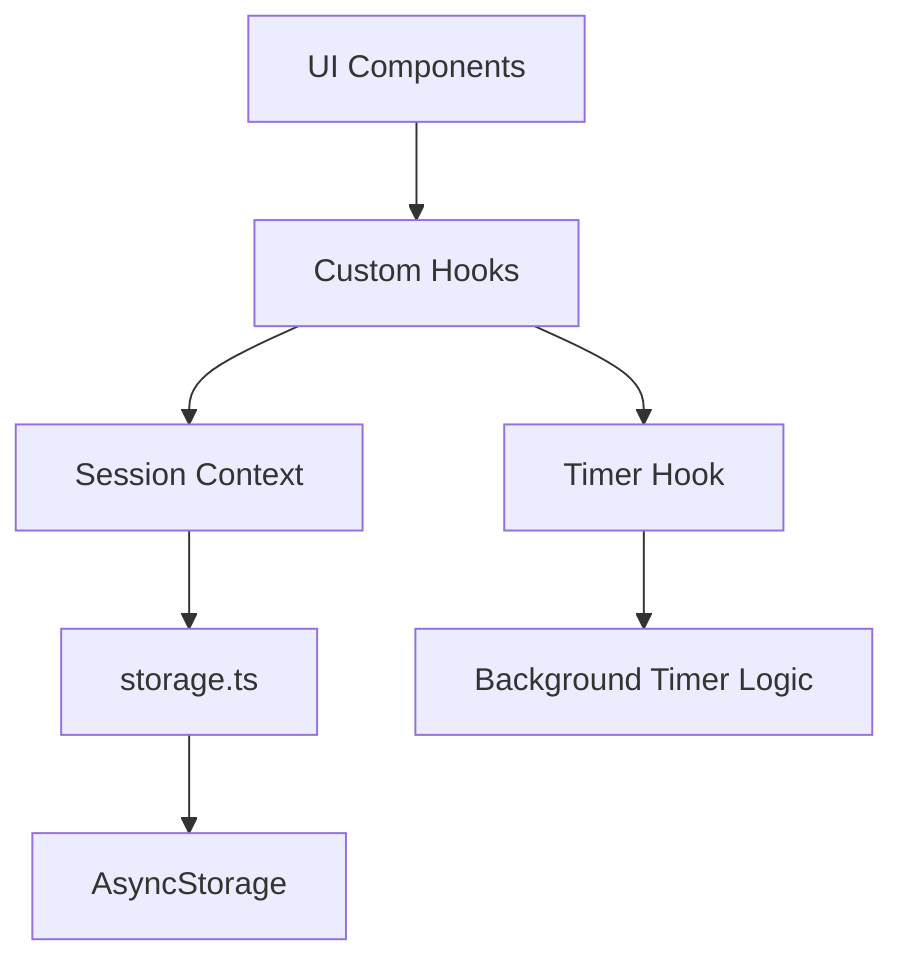
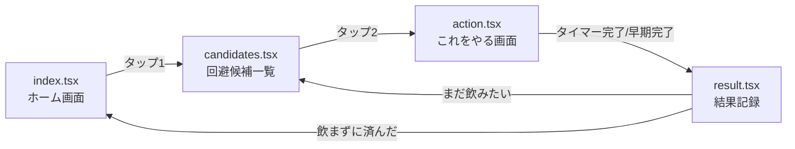
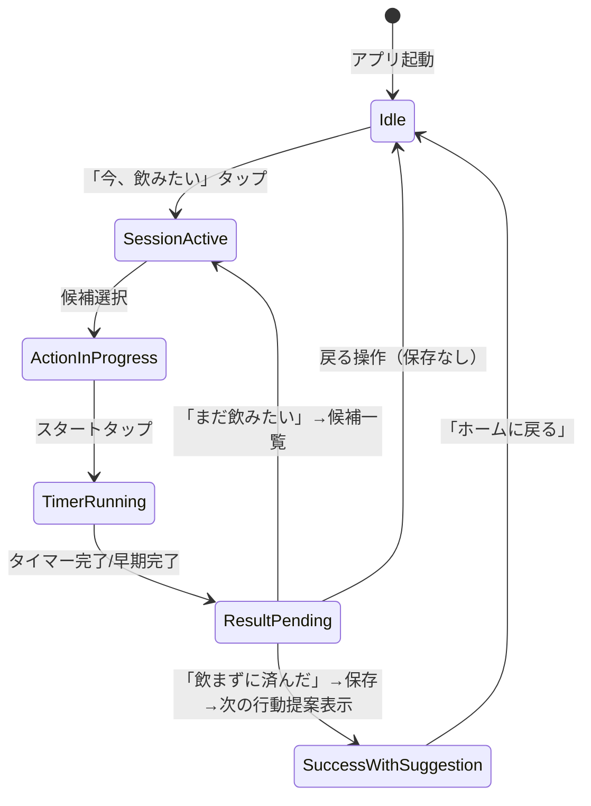

# 技術設計書: Alcoholic Guard（アルコホリックガード）

## 概要

Alcoholic Guard（アルコホリックガード）は、飲酒衝動を感じたユーザーに代替行動を提示し、タイマーで行動を促し、結果を記録するモバイルアプリケーションである。

**設計方針:**

- オフラインファースト: すべてのコア機能はネットワーク不要
- 最小タップフロー: ホーム → 行動選択を2タップ以内で完了
- データ層とUI層の分離: 将来のSupabase連携やクラウド同期に対応可能
- MVP構成: 4〜5画面の最小構成で集中したユーザー体験を提供

**技術スタック:**

- Expo (managed workflow)
- React Native + TypeScript
- Expo Router (ファイルベースルーティング)
- AsyncStorage (ローカルデータ永続化)

## アーキテクチャ

### 全体構成

```
┌─────────────────────────────────────────────────┐
│                   UI Layer                       │
│  (Expo Router Screens + React Native Components)│
└───────────────────────┬─────────────────────────┘
                        │ hooks / context
┌───────────────────────┴─────────────────────────┐
│              State Management Layer              │
│        (React Context + Custom Hooks)            │
└───────────────────────┬─────────────────────────┘
                        │ direct import
┌───────────────────────┴─────────────────────────┐
│                 Data Layer                        │
│          (storage.ts + AsyncStorage)             │
└─────────────────────────────────────────────────┘
```

### レイヤー分離の設計判断

**MVP実装:** MVPではRepository PatternやInterface定義は行わない。ストレージ操作は `src/storage.ts` の1モジュールに集約する。将来Supabase連携時にこのモジュールを差し替える。



**将来構成（参考）:**

```
┌─────────────────────────────────────────────────┐
│                   UI Layer                       │
│  (Expo Router Screens + React Native Components)│
└───────────────────────┬─────────────────────────┘
                        │ hooks / context
┌───────────────────────┴─────────────────────────┐
│              State Management Layer              │
│        (React Context + Custom Hooks)            │
└───────────────────────┬─────────────────────────┘
                        │ repository interface
┌───────────────────────┴─────────────────────────┐
│                 Data Layer                        │
│   (Repository Pattern + Storage Adapter)         │
└─────────────────────────────────────────────────┘
```

## コンポーネントとインターフェース

### 画面構成 (Expo Router)

```
app/
├── _layout.tsx          # Root Layout (Providers wrapper)
├── index.tsx            # ホーム画面
├── candidates.tsx       # 回避候補一覧画面
├── action.tsx           # 「これをやる」画面（タイマー）
└── result.tsx           # 結果記録画面
```

**ルーティングフロー:**



### コンポーネント階層

```
App (_layout.tsx)
├── SessionProvider (Context)
│
├── HomeScreen (index.tsx)
│   └── CravingButton
│
├── CandidatesScreen (candidates.tsx)
│   ├── CategoryTabs (8カテゴリ横スクロールフィルタ)
│   ├── CandidateGrid
│   │   └── CandidateCard (個別候補)
│   └── FreeInputModal
│
├── ActionScreen (action.tsx)
│   ├── ActionTitle
│   ├── TimerSelector (5/10/20/30分)
│   ├── TimerDisplay (MM:SS)
│   └── ActionButtons (スタート/早期完了)
│
└── ResultScreen (result.tsx)
    ├── ResultOption (飲まずに済んだ)
    ├── ResultOption (まだ飲みたい)
    └── NextActionSuggestion (回避成功時のみ表示)
```

### 主要カスタムフック

| Hook                          | 役割                                           |
| ----------------------------- | ---------------------------------------------- |
| `useSession()`                | 現在の回避セッション状態管理                   |
| `useTimer(durationSeconds)`   | タイマーのカウントダウンとバックグラウンド対応 |
| `useCandidates(triedActions)` | 試行済み候補を除外したフィルタリング           |

## データモデル

### TypeScript インターフェース

```typescript
// === 回避候補 ===

type CategoryId =
  | "exercise" // 運動
  | "food" // 食事
  | "relax" // リラックス
  | "entertainment" // 娯楽
  | "going-out" // 外出
  | "connect" // 人とつながる
  | "free" // お金を使わない
  | "quick"; // すぐできる

interface AvoidanceCandidate {
  id: string;
  label: string;
  categories: CategoryId[]; // 複数カテゴリに属することを許容
  isPreset: boolean; // プリセット or ユーザー入力
}

// === タイマー ===

type TimerDuration = 300 | 600 | 1200 | 1800; // 5, 10, 20, 30分（秒）

interface TimerState {
  duration: TimerDuration;
  remainingSeconds: number;
  isRunning: boolean;
  startedAt: string | null; // ISO 8601
}

// === セッション ===

type SessionResult = "avoided" | "still-craving";

interface SessionAttempt {
  actionId: string;
  actionLabel: string;
  timerDuration: TimerDuration;
  actualDurationSeconds: number;
  completedAt: string; // ISO 8601
  result: SessionResult;
}

interface AvoidanceSession {
  sessionId: string; // UUID v4
  startedAt: string; // ISO 8601
  cravingTriggered: boolean; // 飲酒衝動発生フラグ
  attempts: SessionAttempt[]; // 各試行の記録
  finalResult: SessionResult;
  totalDurationSeconds: number;
  completedAt: string; // ISO 8601
}

// === ストレージ ===

// src/storage.ts - MVP implementation
const STORAGE_KEY = "@alcoholic_guard/sessions";

export async function saveSessions(sessions: AvoidanceSession[]): Promise<void>;
export async function loadSessions(): Promise<AvoidanceSession[]>;
export async function addSession(session: AvoidanceSession): Promise<void>;
```

### プリセットデータ構造

```typescript
const PRESET_CANDIDATES: AvoidanceCandidate[] = [
  {
    id: "spec-work",
    label: "Alcoholic Guardの要件を30分だけ詰める",
    categories: ["quick", "free"],
  },
  {
    id: "gym-prep",
    label: "ジムの準備をしてそのまま出る",
    categories: ["exercise", "going-out"],
  },
  {
    id: "walk-30",
    label: "30分だけ散歩する",
    categories: ["exercise", "going-out", "free"],
  },
  {
    id: "shower",
    label: "シャワーを浴びる",
    categories: ["quick", "relax", "free"],
  },
  {
    id: "non-alc",
    label: "水・炭酸水・ノンアルを飲む",
    categories: ["quick", "food", "free"],
  },
  { id: "meal", label: "しっかり飯を食う", categories: ["food"] },
  {
    id: "high-protein",
    label: "高タンパク飯やプロテインを取る",
    categories: ["food", "quick"],
  },
  {
    id: "video",
    label: "YouTubeやNetflixを30分見る",
    categories: ["entertainment", "relax", "free"],
  },
  {
    id: "game",
    label: "ゲームを30分やる",
    categories: ["entertainment", "free"],
  },
  {
    id: "music",
    label: "音楽を聴く・ドラムを叩く",
    categories: ["entertainment", "relax", "free"],
  },
  {
    id: "clean",
    label: "部屋を1か所だけ掃除する",
    categories: ["quick", "free"],
  },
  {
    id: "go-out",
    label: "コンビニ以外の場所へ行く",
    categories: ["going-out"],
  },
  {
    id: "contact",
    label: "誰かにLINEする・電話する",
    categories: ["connect", "quick", "free"],
  },
  {
    id: "nap",
    label: "ベッドで30分だけ横になる",
    categories: ["relax", "free"],
  },
  {
    id: "cafe",
    label: "カフェに行ってコーヒーやソフトドリンクを飲む",
    categories: ["going-out", "food"],
  },
];
```

## 状態管理

### SessionContext

セッションの状態を全画面で共有するためにReact Contextを使用する。`completeSession`は`storage.ts`の`addSession()`を直接呼び出してセッションを保存する。

```typescript
interface SessionContextState {
  currentSession: {
    sessionId: string;
    startedAt: string;
    attempts: SessionAttempt[];
    triedActionIds: string[];
  } | null;
  startSession: () => void;
  addAttempt: (attempt: SessionAttempt) => void;
  completeSession: (finalResult: SessionResult) => Promise<void>;
  resetSession: () => void;
}
```

**設計判断:** Redux等の外部状態管理ライブラリは使用しない。MVPの画面数（4〜5画面）とデータフローの単純さから、React Context + useReducerで十分である。将来的に状態が複雑化した場合はZustandへの移行を検討する。

### 状態遷移図



## ストレージ戦略

### AsyncStorage 設計

```typescript
// ストレージキー
const STORAGE_KEY = "@alcoholic_guard/sessions";
```

**保存形式:** JSON文字列としてAsyncStorageに格納。

**storage.ts 実装方針:**

1. 読み取り: `loadSessions()` で全レコードをパースして返す
2. 書き込み: `addSession()` で既存配列に追加して全体を保存（Appendモデル）
3. エラーハンドリング: try-catchで例外をキャッチし、呼び出し元に明示的にエラーを返す

**将来のクラウド同期対応:**

- `sessionId` (UUID) により一意性を保証
- `startedAt` / `completedAt` のISO 8601タイムスタンプで同期時の競合解決が可能
- スキーマバージョニングは将来対応（MVP段階では実装しない）

## タイマー実装方針

### バックグラウンド対応戦略

React NativeではバックグラウンドでのsetInterval実行が保証されないため、**絶対時刻ベース**のタイマー方式を採用する。

```typescript
// タイマーロジックの核心
interface TimerLogic {
  startTime: number; // Date.now() at start
  duration: number; // milliseconds
  getRemainingMs: () => number; // duration - (Date.now() - startTime)
}
```

**動作原理:**

1. スタート時に `Date.now()` を記録
2. 残り時間 = `duration - (Date.now() - startTime)` で常に計算
3. フォアグラウンド復帰時に `Date.now()` から正確な残り時間を再計算
4. バックグラウンドで「時間を数える」のではなく、フォアグラウンド復帰時に「経過時間を算出する」

**UIの更新:**

- フォアグラウンド時は1秒ごとに `setInterval` でUIを再描画
- `AppState` イベントでフォアグラウンド復帰を検知し、残り時間を再計算

**タイマー完了通知:**

- Expo Notificationsのスケジュール通知で、タイマー終了時刻に通知を予約
- バックグラウンドでタイマーが終了した場合も通知が届く
- `expo-haptics` で振動フィードバック

### フォーマット関数

```typescript
function formatTimer(remainingSeconds: number): string {
  const minutes = Math.floor(remainingSeconds / 60);
  const seconds = remainingSeconds % 60;
  return `${String(minutes).padStart(2, "0")}:${String(seconds).padStart(2, "0")}`;
}
```

## 正確性プロパティ

_プロパティとは、システムのすべての有効な実行を通じて真であるべき特性や振る舞いのことである。つまり、システムが何をすべきかについての形式的な宣言である。プロパティは、人間が読める仕様と機械で検証可能な正確性保証の架け橋として機能する。_

### Property 1: カテゴリ最小サイズ

*任意の*カテゴリIDに対して、そのカテゴリに属するプリセット回避候補の数は2以上である。

**Validates: Requirements 2.3**

### Property 2: 複数カテゴリ所属

*任意の*回避候補について、`categories`配列に複数のカテゴリIDを含むことが許容され、その候補は各カテゴリでフィルタリングした際にすべてのカテゴリの結果に出現する。

**Validates: Requirements 2.5**

### Property 3: タイマーフォーマットの正確性

*任意の*0以上の整数`remainingSeconds`に対して、`formatTimer(remainingSeconds)`の結果は`/^\d{2}:\d{2}$/`の形式に一致し、かつパースすると元の秒数と等価になる（`minutes * 60 + seconds === remainingSeconds`）。

**Validates: Requirements 3.6**

### Property 4: 試行済み候補の除外

*任意の*セッション状態と試行済みアクションIDのセットに対して、`useCandidates(triedActionIds)`が返す候補リストには、`triedActionIds`に含まれるIDを持つ候補が一切含まれない。

**Validates: Requirements 4.3**

### Property 5: セッション記録の完全性

*任意の*有効な完了セッションに対して、保存されるレコードは以下のフィールドをすべて含む: sessionId（非空文字列）、startedAt（ISO 8601形式）、cravingTriggered（boolean）、attempts（配列）、finalResult、totalDurationSeconds（0以上の整数）、completedAt（ISO 8601形式）。

**Validates: Requirements 4.2, 5.1**

### Property 6: セッション記録のシリアライゼーションラウンドトリップ

*任意の*有効な`AvoidanceSession`オブジェクトに対して、`JSON.parse(JSON.stringify(session))`は元のオブジェクトと深い等価性を持つ。

**Validates: Requirements 5.2**

### Property 7: 複数試行のセッション集約

*任意の*1回以上の試行を持つセッションについて、`attempts`配列の長さはセッション中に実行された試行回数と等しく、すべての試行が1つのセッションレコード内に含まれる。

**Validates: Requirements 5.3**

### Property 8: 自由入力バリデーション

*任意の*文字列`input`に対して、自由入力バリデーション関数は以下の条件を満たす場合にのみ`true`を返す: `input.trim().length > 0` かつ `input.length <= 50`。それ以外のすべての文字列に対して`false`を返す。

**Validates: Requirements 7.3, 7.4, 7.5**

### Property 9: 次の行動提案の排他性

*任意の*回避成功セッションにおいて、「次にやること」として提案される候補は、直前に選択された回避行動と異なるIDを持つ。

**Validates: Requirements 8.2**

## エラーハンドリング

### エラー分類と対応方針

| エラー種別             | 発生箇所     | 対応                                         |
| ---------------------- | ------------ | -------------------------------------------- |
| ストレージ保存失敗     | storage.ts   | ユーザーにメッセージ表示 + 再試行ボタン      |
| ストレージ読み取り失敗 | アプリ起動時 | エラー画面 + 再試行ボタン                    |
| JSONパースエラー       | storage.ts   | データ破損として空データで初期化（ログ記録） |
| バリデーションエラー   | 自由入力     | インライン入力エラー表示                     |

### エラーUI方針

- **致命的エラー（起動不可）:** フルスクリーンエラー画面 + 再試行ボタン
- **操作エラー（保存失敗）:** Snackbar/Toast + 再試行ボタン
- **入力エラー（バリデーション）:** フィールド下のインラインメッセージ

### エラーバウンダリ

```typescript
// app/_layout.tsx でErrorBoundaryをラップ
// React Native用のエラーバウンダリでクラッシュを防止
```

## テスト戦略

### テストアプローチ

**デュアルテスト方式:**

- **ユニットテスト**: 具体的なシナリオ、エッジケース、エラー条件
- **プロパティテスト**: ランダム入力による普遍的プロパティの検証

### プロパティベーステスト

**ライブラリ:** `fast-check` (TypeScript/JavaScript向けプロパティベーステストライブラリ)

**設定:**

- 各プロパティテストは最低100イテレーション実行
- 各テストにはデザインドキュメントのプロパティへのタグコメントを付与
- タグ形式: `Feature: alcohol-avoidance-app, Property {number}: {property_text}`

**テスト対象関数（ピュアロジック層）:**
| 関数 | テスト種別 | 対応Property |
|------|-----------|-------------|
| `filterByCategory()` | Property | Property 1, 2 |
| `formatTimer()` | Property | Property 3 |
| `excludeTriedCandidates()` | Property | Property 4 |
| `createSessionRecord()` | Property | Property 5, 7 |
| `serializeSession()` / `deserializeSession()` | Property | Property 6 |
| `validateFreeInput()` | Property | Property 8 |
| `suggestNextAction()` | Property | Property 9 |

### ユニットテスト

**ライブラリ:** Jest (Expo標準)

**テスト対象:**

- 画面遷移フロー（React Native Testing Library）
- タイマーの開始/停止/完了ロジック
- storage.ts のCRUD操作（AsyncStorageモック使用）
- エラーハンドリング（保存失敗時のリトライ挙動）
- プリセットデータの整合性（8カテゴリ存在、各カテゴリ2件以上）

### テストファイル構成

```
__tests__/
├── properties/
│   ├── candidates.property.test.ts   # Property 1, 2, 4
│   ├── timer.property.test.ts        # Property 3
│   ├── session.property.test.ts      # Property 5, 6, 7
│   ├── validation.property.test.ts   # Property 8
│   └── suggestion.property.test.ts  # Property 9
├── unit/
│   ├── timer.test.ts
│   ├── storage.test.ts
│   └── presets.test.ts
└── integration/
    └── session-flow.test.ts
```
